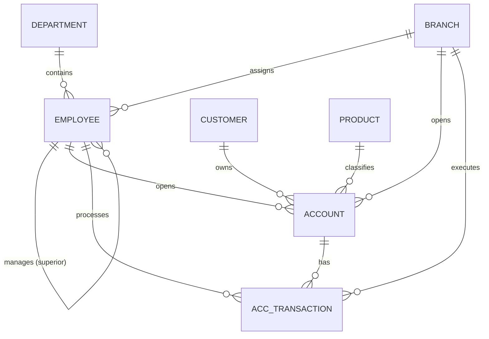

# SQL & Relational Databases Practice

[](#)
[](#)
[](#)

A hands-on repository for learning how to design relational databases and write complex SQL queries. The project is based on the classic “Bank DB” domain (bank accounts, customers, branches, employee hierarchy, and financial transactions).

---

## Tech Stack & Roadmap

- [x] **SQLite3** — the current DBMS for practicing basic and advanced SQL without the overhead of server infrastructure.
- [ ] **PostgreSQL** — planned transition to a full-fledged RDBMS (joins, CTEs, indexes, query plan optimization using `EXPLAIN ANALYZE`).
- [ ] **Docker & Docker Compose** — deploying PostgreSQL in an isolated container with a volume mount for data persistence.

---

## ER Diagram of a Database (Bank DB)


# Quick start

To deploy the database and run the practice scripts locally, follow these steps.

# Requirements:
- git
- sqlite3 

# 1. Cloning a repository:
``` Bash
git clone [https://github.com/Disha-aa/sql-roadmap-learning.git](https://github.com/Disha-aa/sql-roadmap-learning.git)
cd sql-roadmap-learning
```
# 2. Initializing and Populating the Database
The database is generated from code (DDL + DML) with a single command:
``` Bash
sqlite3 db/bank.db < db/schema.sql && sqlite3 db/bank.db < db/seed.sql
```

# 3. Launching the SQLite Interactive Console
``` Bash
sqlite3 db/bank.db
```